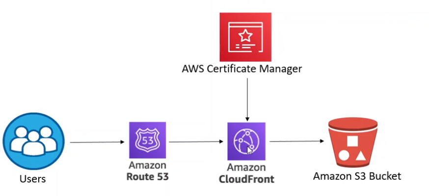

#🌟 Static Website Deployment on AWS 🌟

## Overview of the Project
The project aims to establish a robust and efficient static website hosting solution using Amazon Web Services (AWS). By leveraging key services such as Amazon S3 for scalable storage, CloudFront for global content delivery, and Route 53 for domain management, this project addresses the need for a reliable and performant web presence.

## Architecture


## Step-by-Step Guide
### 1. Setup S3 Bucket
- **Create S3 Bucket:** Create an S3 bucket to store your static website files.
  - Ensure to disable block public access and enable static website hosting during bucket creation.
- **Upload Website Files:** Upload your website files to the S3 bucket.

### 2. Configure S3 Bucket for Website Hosting
- **S3 Bucket Policies:** Add the following bucket policy to allow public read access to objects:
```json
{
  "Version": "2012-10-17",
  "Statement": [
    {
      "Sid": "publicreadgetobject",
      "Effect": "Allow",
      "Principal": "*",
      "Action": "s3:GetObject",
      "Resource": [
        "arn:aws:s3:::my-static-website/*"
      ]
    }
  ]
}
```
- Enable Website Hosting: Ensure that static website hosting is enabled in the S3 bucket properties.
- Set Index Document: Define the index document and error document in the bucket properties.
### 3. Configure CloudFront Distribution
- Create CloudFront Distribution: Create a CloudFront distribution with the S3 bucket as the origin.
- Configure Settings: Set up cache behaviors, alternate domain names (CNAMEs), and SSL certificate.
### 4. Configure Route 53
- Create Hosted Zone: Create a hosted zone for your domain in Route 53.
- Configure DNS Records: Add DNS records to point to the CloudFront distribution.
### 5. Configure AWS Certificate Manager
- Request SSL/TLS Certificate: Request an SSL/TLS certificate for your domain using AWS Certificate Manager.
- Validate Certificate: Validate the certificate via DNS verification.
### 6. Test Your Website
- Verify Setup: Verify that your website is accessible via the custom domain over HTTPS.
- Test Performance: Test the performance of your website using various tools.
## Challenges Faced
- Challenge 1: Setting up proper permissions for the S3 bucket.
- Solution: Configured bucket policies and access control lists (ACLs) to allow public access to website files.
- Challenge 2: Configuring CloudFront with the correct settings.
- Solution: Adjusted cache behaviors and origin settings to ensure proper routing and caching behavior.

